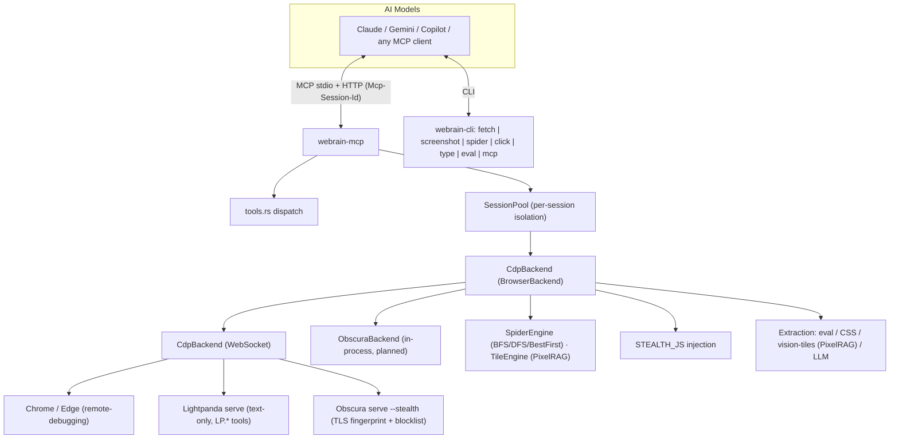
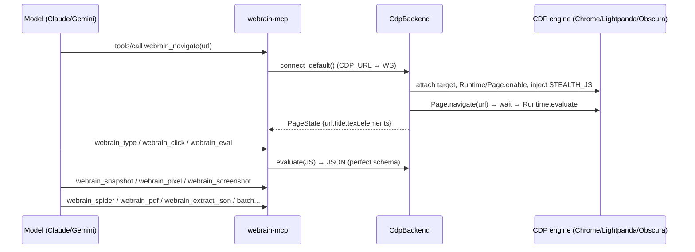

# webrain — Next-Gen AI Browser Tool: Architecture & Project Structure

> **Status: design + implemented core.** The CDP agent tool, MCP server, stealth
> injection, and engines described here are **implemented and verified end-to-end**
> (Cloudflare-protected login → credentials → structured product extraction, driven
> both by the CLI and over MCP). The sections marked **"planned"** are the researched
> next steps. Supersedes the root `ARCHITECTURE.md` (historical). Formerly **Webrain**;
> renamed **webrain**.

## 1. Positioning

webrain is a **Rust-native CDP browser agent tool** that gives Claude, Gemini, and
any MCP-speaking model the power to:

- **fetch web pages** (single + parallel batch),
- **interact with pages** (click, type, scroll, eval, navigate),
- **scrape with a perfect schema** (arbitrary JS → JSON, CSS extraction, PixelRAG vision tiles),
- **take screenshots** (single + batch, full-page),
- **spider / crawl** websites (BFS),
- do all of it through a **stealth, anti-bot browser layer**,
- be a **drop-in Puppeteer/Playwright replacement** — same `Browser → Context → Page`
  mental model, but over **Lightpanda + Obscura** (alternative engines) instead of
  Chromium.

The engine is **backend-agnostic**: webrain-core defines one `BrowserBackend` trait and
talks CDP, so it drives **any** CDP server — Chrome, **Lightpanda**, or **Obscura** —
with the same code. That is the whole architectural bet: *the browser engine is a
pluggable transport, not the product; the agent-facing tool surface is the product.*

## 2. Language decision: **Rust**

| Criterion | Rust (chosen) | Python |
|---|---|---|
| Obscura integration | Native (V8 via `deno_core`), no subprocess | FFI overhead, would need a sidecar |
| Lightpanda | Clean CDP WebSocket client (already built) | Works, but GIL-bound, 100MB+ deps |
| Stealth TLS fingerprinting | `wreq`/BoringSSL (obscura-net): real Chrome TLS | No native TLS control |
| MCP server | Single ~15MB binary, stdio JSON-RPC | Needs interpreter at deployment |
| Performance | Zero-copy, sub-ms, no GIL | GIL-bound |
| AI-model consumers | MCP protocol (language-agnostic) | Same, via MCP |

Python's real strength is **vision/embeddings and crawler strategies** (PixelRAG-style
screenshot indexing, crawl4ai-style extraction). That is a **companion layer**
(`webrain-python`, PyO3), not the core. The core stays Rust.

## 3. Research distilled (what each reference teaches us)

| Reference | Lesson applied |
|---|---|
| **obscura** (`h4ckf0r0day/obscura`) | 8-crate Rust workspace is the reference shape: `cli / cdp / js / dom / net / mcp / browser / lib`. Stealth = *consistent* profile (UA ↔ TLS ↔ navigator ↔ WebGL agree) + `wreq` Chrome TLS fingerprint + 3,520-domain tracker blocklist. `isolated_copy()` context isolation. CDP `LP.getMarkdown`. **Honest ceiling:** no interactive CAPTCHAs / Datadome / Akamai. |
| **lightpanda** (`lightpanda-io/browser`) | Text-only headless browser (V8, no rendering) — the cheapest read for LLMs. Native MCP over stdio **and** HTTP with `Mcp-Session-Id` isolation (multi-agent, one process). `driver_guidance` returned in MCP `initialize`. CDP server is Puppeteer-compatible → webrain's `CdpBackend` drives it with zero new code. `LP.getMarkdown` / `getStructuredData` / `getInteractiveElements`. |
| **camoufox** (`daijro/camoufox`) | The stealth ceiling: fingerprint spoofing at the **C++ level** (invisible to JS), per-context audio/canvas/font/WebGL/timezone/screen/speech/WebRTC isolation, real scraped fingerprint presets, human-like mouse. We cannot match C++-level spoofing; we adopt the *list of surfaces to keep internally consistent* and mask what JS can mask (webdriver, plugins, WebGL, timezone). |
| **PixelRAG** (`StarTrail-org/PixelRAG`) | "Web screenshots beat text for RAG": render pages to screenshot tiles, embed with a vision model, retrieve over images. Gives the model **eyes** (tables/charts/layout survive). → webrain's `webrain_pixel`: screenshot tiles (CDP clip) for vision reads. |
| **browser-harness** (`browser-use/browser-harness`) | Thin long-lived daemon (middleman) owning the CDP socket; IPC relay with ping handshake + token; **coordinate-based clicks** pass through iframes/shadow/cross-origin at the compositor level; self-healing attach. → webrain's MCP server owns the CDP connection; add coordinate clicks + self-heal. |
| **hermes-agent** (`NousResearch/hermes-agent`) | Agent-browser standard: **accessibility-tree text snapshot** for LLMs + **ref selectors** (`@e1`) for interaction + session isolation per task + vision/console/get_images tools. → webrain's `elements[].index` + snapshot + `webrain_eval`. |
| **page-agent / browser-use** | `BrowserState` = `{url, title, header, content, footer}` with scroll hints; DOM-tree → simplified text for the LLM; index-based actions; no screenshots required. → webrain's `PageState` already matches; add scroll-position hints. |
| **crawl4ai** (`unclecode/crawl4ai`) | Extraction strategies: CSS/JSON selectors → LLM extraction with a schema; crawling with concurrency + BFS/adaptive. → webrain's `webrain_eval` (JS→JSON, proven) + `webrain_extract_json` (CSS-schema, zero-LLM); spider already BFS. |
| **Agent-Reach** (`Panniantong/Agent-Reach`) | Capability-router pattern: per-platform *ordered backend list* + health-check (`doctor`). → webrain's backend selection (Cdp → Obscura → Lightpanda) with a `doctor`-style health probe. |

## 4. System architecture



### Layers

1. **webrain-core** (lib) — types, traits, engines, CDP client. No binary.
2. **webrain-mcp** (lib) — MCP server over stdio **and** HTTP (`mcp --http <port>`,
   per-`Mcp-Session-Id` sessions); owns the CDP connection; tool dispatch.
3. **webrain-cli** (bin) — single `webrain` binary, subcommands via `match` (no clap).
4. **(planned) webrain-python** — PyO3 bindings + PixelRAG-style visual index + crawler
   strategies. Companion, not core.

## 5. Project structure

```
webrain/
├── Cargo.toml                  # workspace root (resolver 3, edition 2024, rust 1.85)
├── ARCHITECTURE.md             # historical
├── docs/
│   └── ARCHITECTURE.md         # this file (authoritative)
├── webrain-core/
│   ├── Cargo.toml              # tokio, serde, anyhow, async-trait, tokio-tungstenite,
│   │                           # futures-util, url, base64, ureq
│   │                           # optional (feature "obscura"): obscura git dep, rev-pinned
│   └── src/
│       ├── lib.rs              # re-exports (CdpBackend, engines, vision)
│       ├── browser.rs          # BrowserBackend trait · PageState · PageResult ·
│       │                       #   InteractiveElement
│       ├── engines.rs          # SpiderEngine (BFS/DFS/BestFirst, domain+robots
│       │                       #   filters, discover-only prefetch) · TileEngine
│       │                       #   (PixelRAG tiles) · concurrent batch (per-tab
│       │                       #   sessions) · http_fetch · bm25_filter ·
│       │                       #   validate_urls · build_extract_js · regex
│       ├── vision.rs           # PixelRAG vision-embedding index: EmbeddingClient
│       │                       #   (OpenAI-compat /embeddings; EMBED_URL/EMBED_MODEL/
│       │                       #   EMBED_API_KEY) · VectorStore (JSONL + in-memory
│       │                       #   cosine) · index_current_page / retrieve
│       └── backends/
│           ├── mod.rs
│           └── cdp.rs          # CdpBackend: connect / connect_default (CDP_URL) /
│                               #   resolve_ws · send_cmd · tab registry (open / activate /
│                               #   close / list) + per-session navigate/eval/screenshot
│                               #   (concurrent multi-tab batch) · a11y · STEALTH_JS +
│                               #   ELEMENTS_JS · navigate / screenshot / clip / pdf /
│                               #   snapshot (D1 skip) / evaluate / click / type_text /
│                               #   scroll / get_html
├── webrain-mcp/
│   ├── Cargo.toml
│   └── src/
│       ├── lib.rs              # run_stdio() / run_http(): initialize / ping /
│       │                       #   tools/list / tools/call; lazy CDP connect
│       └── tools.rs            # 34 tools (see §9) + dispatch; webrain_eval → JS→JSON
├── webrain-cli/
│   ├── Cargo.toml
│   └── src/
│       └── main.rs             # webrain [mcp|fetch|screenshot|spider|click|type|eval];
│                               #   tracing → stderr (MCP stdout stays pure JSON)
└── target/                     # build artifacts
```

## 6. Core abstractions

```rust
#[async_trait]
pub trait BrowserBackend: Send + Sync {
    async fn navigate(&self, url: &str) -> anyhow::Result<PageState>;
    async fn screenshot(&self, full_page: bool) -> anyhow::Result<Vec<u8>>;
    async fn screenshot_clip(&self, x: f64, y: f64, w: f64, h: f64) -> anyhow::Result<Vec<u8>>;
    async fn pdf(&self) -> anyhow::Result<Vec<u8>>;
    async fn snapshot(&self) -> anyhow::Result<PageState>;               // D1 fingerprint skip
    async fn evaluate(&self, js: &str) -> anyhow::Result<serde_json::Value>;
    async fn click(&self, index: usize) -> anyhow::Result<()>;
    async fn type_text(&self, index: usize, text: &str) -> anyhow::Result<()>;
    async fn scroll(&self, direction: &str) -> anyhow::Result<()>;
    // Multi-tab + accessibility (defaults: unsupported on backends that lack them).
    async fn open_tab(&self, _url: &str) -> anyhow::Result<String> {
        anyhow::bail!("open_tab not supported by this backend")
    }
    async fn activate_tab(&self, _id: &str) -> anyhow::Result<()> {
        anyhow::bail!("activate_tab not supported by this backend")
    }
    async fn close_tab(&self, _id: &str) -> anyhow::Result<()> {
        anyhow::bail!("close_tab not supported by this backend")
    }
    async fn list_tabs(&self) -> anyhow::Result<serde_json::Value> {
        anyhow::bail!("list_tabs not supported by this backend")
    }
    async fn a11y(&self) -> anyhow::Result<serde_json::Value> {
        anyhow::bail!("a11y not supported by this backend")
    }
    async fn get_html(&self) -> anyhow::Result<String>;
    fn backend_name(&self) -> &'static str;
}
```

- **New (BrowseMind-inspired) trait methods** (defaults where sensible):
  - `screenshot_clip` — CDP `Page.captureScreenshot` with a `clip` (PixelRAG tiles).
  - **`navigate` is Queen-Reader-fast** — polls `document.readyState` until
    `DOMContentLoaded` (interactive), only waits for full load when text < 500 chars.
    Absorbed the old `read_fast`/`webrain_read` (one wait strategy, one tool).
  - **Vision-first read (PixelRAG)** — `webrain_pixel` tiles are the structured read:
    layout/tables/charts survive for a vision LLM. No HTML→Markdown converter is shipped.
    *Rejected microsoft/markitdown:* a Python *file* converter (PDF/DOCX/PPTX) needing a
    subprocess — wrong fit for a single Rust binary and violates low-memory; files are
    captured via CDP `Page.printToPDF` (`webrain_pdf`) instead. Read ladder = innerText
    (`navigate`, cheapest) → `webrain_pixel` tiles (layout) → `webrain_eval` (structure).
  - `pdf` — `Page.printToPDF` → bytes.
  - `snapshot` — re-capture current page **without navigating**; **D1 DOM-fingerprint
    skip** (element count + text hash) returns the cached state when the page is unchanged.
- **Multi-tab** — one browser-level WS + a registry of per-tab CDP sessions; commands
  route to the **active** tab. `open_tab` (createTarget + attach + stealth init),
  `activate_tab` (validates, resets D1 caches), `close_tab` (Target.closeTarget, reassigns
  active), `list_tabs` → `[{id, url, active}]`. `next_tab_id` is a single allocator shared
  by `ensure_page_attached` and `open_tab` (verified live: 3 tabs, switch, close).
- **a11y** — `Accessibility.getFullAXTree` → flattened `[{role, name, value}]`.
  **Read-only** structure probe (hermes-agent pattern); interaction stays on
  `elements[].index` (click/type).
- `CdpBackend::connect_default()` reads `CDP_URL` (default `http://127.0.0.1:9222`),
  resolves `/json/version` → WS, attaches to the first page target (or creates one),
  enables Runtime/Page, and injects `STEALTH_JS` via `Page.addScriptToEvaluateOnNewDocument`.

- `PageState { url, title, text, elements }` — **visible text, not full HTML** (keeps
  MCP tokens manageable; the LLM reads `text`/`elements`).
- `InteractiveElement { index, tag, text, selector, visible }` — index-based actions;
  maps to hermes-style `@eN` refs and obscura `data-obscura-ref`.
- Engines (`SpiderEngine`, `TileEngine`) are **generic over `&impl BrowserBackend`** —
  one signature runs them against `CdpBackend` or any future backend. No wrapper type.
- `CdpBackend::connect_default()` reads `CDP_URL` (default `http://127.0.0.1:9222`),
  resolves `/json/version` → WS, attaches to the first page target (or creates one),
  enables Runtime/Page, and injects `STEALTH_JS` via `Page.addScriptToEvaluateOnNewDocument`.

## 7. Backends (pluggable engines)

| Backend | Transport | Status | Notes |
|---|---|---|---|
| `CdpBackend` | CDP WebSocket | **implemented, verified** | Drives Chrome/Edge (`--remote-debugging-port`), Lightpanda `serve`, Obscura `serve --stealth`. **Multi-tab**: one browser WS + per-tab session registry, active-tab routing. |
| `ObscuraBackend` | in-process (obscura git dep) | planned | Native Rust stealth: `wreq` Chrome TLS fingerprint, tracker blocklist, `isolated_copy()` contexts. No subprocess. |
| `LightpandaBackend` | CDP WebSocket to `lightpanda serve` | planned (works via CdpBackend today) | Text-only, cheapest reads. Use `LP.getMarkdown`, `LP.getInteractiveElements`, `LP.getStructuredData`, `LP.waitForSelector`. |

**Engine selection (`doctor`-style):** prefer Obscura for stealth-sensitive targets,
Lightpanda for high-volume text reads, Chrome for maximum site compatibility
(real rendering). Health-probe the endpoint before dispatch.

## 8. Stealth strategy (three layers + honest limits)

1. **TLS fingerprint** — Obscura's `wreq`/BoringSSL client: real Chrome ClientHello,
   ALPN, cipher order. Defeats passive JA3/JA4 bot management. *(Requires the Obscura
   backend / `--stealth` build; `CdpBackend` inherits whatever TLS the CDP engine uses.)*
2. **JS fingerprint** (always on, in `CdpBackend`) — `navigator.webdriver=false`,
   `plugins` length, `languages`, `maxTouchPoints`, `window.chrome`; all surfaces kept
   internally consistent with the UA. Verified live.
3. **Tracker blocking** — Obscura's 3,520-domain blocklist (with the Obscura backend).

**Honest limits** (from obscura + camoufox docs): interactive CAPTCHAs (Turnstile
interactive, hCaptcha), Datadome/Akamai *active* challenges, WebGPU/WebAssembly
fingerprinting quirks, and IP-based rate limiting (use proxies). Real-stealth claims
beyond this are not made.

## 9. MCP tool surface (`webrain-mcp`)

| Tool | Input → Output |
|---|---|
| `webrain_navigate` | `url` → `{url, title, text, elements[]}`; Queen-Reader-fast read (DOMContentLoaded-first, full-load fallback) |
| `webrain_eval` | `js` → JSON result (**the "perfect schema" tool**: JS→JSON, e.g. product arrays) |
| `webrain_screenshot` | `full_page?` → base64 PNG |
| `webrain_click` / `webrain_type` / `webrain_scroll` | index-based interaction |
| `webrain_get_html` | selector? → HTML |
| `webrain_spider` | `seed_url, max_depth, max_pages` → BFS results with nested links |
| `webrain_snapshot` | **D1 skip**: current page state without navigating; cached when unchanged |
| `webrain_pixel` | **PixelRAG tiles**: `tile_width?, tile_height?, max_tiles?` → `{count, tiles[{index,x,y,width,height,png_b64}]}` |
| `webrain_extract_json` | **CSS/XPath-schema extraction**: `base_selector` + `fields[{name,selector,type,attr}]` (type: text\|attr\|html\|xpath) → JSON array (zero-LLM) |
| `webrain_pdf` | `{}` → `{pdf_b64}` (Page.printToPDF) |
| `webrain_tab` | `action: new\|switch\|close\|list` → new tab id / tabs `[{id,url,active}]` |
| `webrain_a11y` | `{}` → `[{role, name, value}]` — accessibility-tree structure probe (read-only) |
| `webrain_batch` | `op: fetch\|extract\|screenshot` + `urls[]` (+ `base_selector`, `fields[]`, `dir?`) → one result per URL, one tab each |
| `webrain_download` | `urls[]` + `dir?` → downloads over plain HTTP (fast, no browser; no cookie session) |
| `webrain_search` | `q` + `engine?` (duckduckgo\|bing\|brave\|google) → navigate to results (DDG HTML-lite default, scrape-friendly) |
| `webrain_nav` | `op: back\|forward\|reload` → history/location navigation |
| `webrain_press` | `key?` (Enter/Tab/Escape/…) → key on the focused element; submits forms |
| `webrain_get_images` | `{}` → `[{src, alt, width, height}]` — page image URLs |
| `webrain_console` | `{}` → captured page errors + unhandled rejections (lazy listener, browsemind console-list) |
| `webrain_dismiss_overlays` | `{}` → remove visible fixed/sticky overlays (cookie banners/popups; browsemind C1-C3, manual trigger) |
| `webrain_vision_index` | **PixelRAG vision index**: `tag?, tile_width?, tile_height?, max_tiles?` → capture page tiles, embed via `EMBED_URL`, persist `vision/{tag}.jsonl` → `{indexed, total, dim, model}` |
| `webrain_vision_retrieve` | `tag` + `query` (+ `k?`) → embed query, cosine top-k tile ids `[{id, score}]` |

**Planned MCP additions** (from research): session id support (`Mcp-Session-Id` isolation),
`driver_guidance` instructions in `initialize` (lightpanda pattern). Batch/extract on multi-tab is
**done**; a11y is read-only by design. `webrain_console`/`webrain_get_images` landed this release.

**Protocol hygiene:** tracing writes to **stderr**; MCP stdout is pure JSON (verified).

## 10. Session isolation

Each agent/session gets an isolated browser context (own page, cookies, memory):
- Obscura: `BrowserContext::isolated_copy()`.
- Lightpanda: `Mcp-Session-Id` header routing (share or isolate by id).
- webrain: `SessionPool` keyed by session id (re-introduce; currently one connection).

## 11. CLI (`webrain-cli`)

```
webrain mcp                      # MCP server (default)
webrain fetch <url>              # title + text + element count (Queen-Reader-fast)
webrain screenshot <url>         # full-page PNG
webrain spider <seed>            # BFS crawl (depth 2, 10 pages)
webrain click <i> / type <i> <text> / eval <js>
CDP_URL=http://127.0.0.1:9222  # env: any CDP server — Chrome --remote-debugging-port,
                                #   or Obscura raw ws://127.0.0.1:9222/devtools/browser
EMBED_URL=http://127.0.0.1:11434/v1/embeddings  # env: vision-index embed endpoint
EMBED_MODEL=nomic-embed-text    # env: model id sent to the embed endpoint
EMBED_API_KEY=                  # env: optional Bearer for hosted providers (SiliconFlow)
```

## 12. Request flow (verified)



## 13. Roadmap

1. **Obscura — ✅ working via Docker (this release)**: `obscura serve --port 9222 --host 0.0.0.0 --stealth`
   in `h4ckf0r0day/obscura:latest`; webrain drives it as a **raw WS CDP** endpoint via
   `CDP_URL=ws://127.0.0.1:9222/devtools/browser` (Obscura has no HTTP `/json/version`).
   In-process `ObscuraBackend` still planned; the git dep is declared feature-gated
   (`features = ["obscura"]`) and rev-pinned so the default build stays green:
   `obscura = { git = "https://github.com/h4ckf0r0day/obscura", rev = "3a68457…", features = ["api"], optional = true }`.
2. **Lightpanda mode** — drive `lightpanda serve`; text/interactive-element reads.
3. **Vision index (PixelRAG) — ✅ core this release**: `webrain_vision_index` / `webrain_vision_retrieve`
   in `webrain-core/src/vision.rs` — tiles → `EMBED_URL` (OpenAI-compatible `/embeddings`, default
   vLLM `Qwen/Qwen3-VL-Embedding-2B`) → flat JSONL store + in-memory cosine (swap sqlite-vec past a
   few thousand vectors). **Verified end-to-end** against local Ollama `/v1/embeddings`
   (nomic-embed-text, 768-dim): navigate → index 4 tiles → retrieve top-k → `vision/iploc.jsonl`.
   **Hosted option:** SiliconFlow hosts `Qwen/Qwen3-VL-Embedding-2B`
   (`EMBED_URL=https://api.siliconflow.cn/v1/embeddings`, `EMBED_API_KEY=…`); OpenRouter verified
   to have **no embedding models** (364 chat-only). Companion `webrain-python` (PyO3) still planned.
4. **Extraction upgrade** — LLM schema extraction on top of `webrain_extract_json`.
5. **Batch on multi-page backends** — ✅ **done this release**: single-browser-WS
   multi-tab enables `batch_fetch` / `batch_extract` / `batch_screenshot` (one tab per
   URL, sequential; true parallelism needs N browser processes).
6. **Coordinate clicks** (browser-harness) — pass through iframes/shadow DOM.
   (`webrain_a11y` is read-only; interaction stays on `elements[]` indices.)
7. **Session isolation** — `SessionPool` per `Mcp-Session-Id`.

## 13b. BrowseMind feature integration (this release)

Read `d:\...\Python\browsemind`'s README and integrated its best browsing-efficiency ideas:

| BrowseMind idea | webrain implementation |
|---|---|
| **PixelRAG tile capture** | `webrain_pixel` + `TileEngine` — CDP `clip` per tile (no image decode), capped at `max_tiles` |
| **Queen Reader** (content-first, DOMContentLoaded) | merged into `webrain_navigate` (DOMContentLoaded-first; full-load fallback < 500 chars) |
| **D1 DOM-fingerprint skip** | `snapshot` + `webrain_snapshot` — element count + text hash, returns cached state when unchanged |
| **CSS-schema extraction (zero-LLM)** | `webrain_extract_json` — base selector + field selectors → JSON array, generated JS via `webrain_eval` |
| **PDF capture** (`--pdf`) | `pdf` + `webrain_pdf` (Page.printToPDF) |
| **LLM response caching (50× cost)** | TODO — disk-backed L1/L2 cache for repeated LLM calls (BrowseMind pattern; user memory notes the litellm-cache gap) |
| **Token-budget LLM tiering** | TODO — RULE/CHEAP/FULL tiering on remaining budget |
| **Overlay defense (C1–C3)** | TODO — post-click overlay check + force-remove |
| **Multi-cascade extraction (LLM last)** | partial — zero-LLM `webrain_extract_json`/`webrain_eval` precede any future LLM extraction |
| **Multi-tab (browser-harness sessions)** | `webrain_tab` + `CdpBackend` tab registry — open/switch/close/list tabs over one browser WS (verified live) |
| **Batch (multi-page)** | `webrain_batch` (fetch/extract/screenshot) + engines `batch_*` — one tab per URL |
| **Accessibility-tree snapshot (hermes)** | `webrain_a11y` — `[{role, name, value, css_path, xpath}]` — role/name for understanding, css_path/xpath for precise extraction |
| **Bulk download** | `webrain_download` + `download_files` — plain-HTTP (ureq) to dir; no cookie session |
| **Search (4 engines)** | `webrain_search` — DuckDuckGo (HTML-lite, default) / Bing / Brave / Google result pages |
| **Nav + keys** | `webrain_nav` (back/forward/reload) + `webrain_press` (Enter/Tab/Escape; submits forms) |
| **Images + console** | `webrain_get_images` (src/alt/dims) + `webrain_console` (captured errors/rejections) |
| **Overlay defense (C1-C3)** | `webrain_dismiss_overlays` — manual trigger removing visible fixed/sticky overlays |
| **Index-based interaction** | `ELEMENTS_JS` emits compact `{index,tag,text,selector,visible}` — click/type by index; `css_path`/`xpath` live on `webrain_a11y` for extraction |

## 13c. Git dependency & vision-embedding indexing (how-to)

### Adding Obscura as a git dependency

The embeddable `obscura` crate is **not on crates.io** — depend on it via git. First
build compiles V8 from source (~5 min, few GB).

```toml
[dependencies]
obscura = { git = "https://github.com/h4ckf0r0day/obscura", features = ["api"] }
# add "stealth" for wreq/BoringSSL TLS impersonation (needs cmake + clang/libclang)
# obscura = { git = "https://github.com/h4ckf0r0day/obscura", features = ["api", "stealth"] }
```

- Pin a revision for reproducibility: `rev = "<sha>"` or `tag = "vX.Y.Z"`.
- Dev loop: clone obscura locally and use `obscura = { path = "../obscura" }` (no V8 recompile
  per edit; only on first build).
- **Zero-code alternative:** `obscura serve` (or `obscura serve --stealth`) runs a CDP
  server on `:9222` — `CdpBackend` already drives it via `CDP_URL`.

### Vision-embedding indexing (PixelRAG recipe)

PixelRAG proves *"web screenshots beat text for RAG"* — tables/charts/layout survive.
Its pipeline, adapted to webrain:

```
Render → screenshot tiles (webrain_pixel / TileEngine)
  → embed tiles with a vision model (Qwen3-VL-Embedding-2B, 2048-dim, cosine)
  → index vectors (FAISS IVF at scale, or sqlite-vec locally)
  → retrieve top-k by cosine (text or image query)
  → feed tiles to a VLM to read the answer
```

Concrete choices (from PixelRAG's code):
- **Tiles:** ~512px with overlap; chunk large tiles (e.g. 8192px → 1024px strips) to
  cut VLM token count ~8×. Cap by context: `max_tiles ≈ (context − 2000) / tokens_per_tile`
  (≈1500–2000 tokens/tile).
- **Embedding model:** `Qwen/Qwen3-VL-Embedding-2B` (2048-dim) via vLLM/HF;
  alternatives: Jina CLIP API (single/multivector), ColQwen2 (multi-vector).
- **Index:** FAISS `IndexIVFFlat` (nlist/nprobe) for large corpora; `sqlite-vec` for a
  single-user local index (fits webrain's "one binary, no infra" ethos).
- **Retrieval:** cosine over embeddings; multi-image queries aggregate per-tile max score.
- **Minimum viable first cut (recommended):** skip the index — `webrain_pixel` gives you
  N tiles for a page; send the top-N tiles straight to a vision LLM. Add the vector index
  only when you have enough pages that scanning all tiles gets expensive.

## 14. Decisions

| Decision | Rationale |
|---|---|
| Rust core, Python companion | Obscura is Rust-native; single binary; Python only for vision/strategies |
| One `BrowserBackend` trait, pluggable CDP engines | Engine is a transport, not the product; Chrome/Lightpanda/Obscura swap behind one API |
| Text-first reads + optional visual (PixelRAG) | Cheapest correct reads for LLMs; vision only when layout/tables matter |
| MCP as the only AI interface | Claude/Gemini/Cursor all speak MCP; no custom protocol |
| Stealth in 3 layers, honest limits | TLS + JS fingerprint + tracker blocking; no false "bypasses CAPTCHA" claims |
| BFS spider, no priority queue | Simple visited set; add BestFirst when needed |
| tracing → stderr | MCP stdout must be pure JSON |

## 15. References

- [obscura](https://github.com/h4ckf0r0day/obscura) · [lightpanda](https://github.com/lightpanda-io/browser)
- [camoufox](https://github.com/daijro/camoufox) · [PixelRAG](https://github.com/StarTrail-org/PixelRAG)
- [browser-use / browser-harness](https://github.com/browser-use/browser-harness)
- [page-agent](https://github.com/alibaba/page-agent) · [hermes-agent](https://github.com/NousResearch/hermes-agent)
- [Agent-Reach](https://github.com/Panniantong/Agent-Reach) · [crawl4ai](https://github.com/unclecode/crawl4ai)
