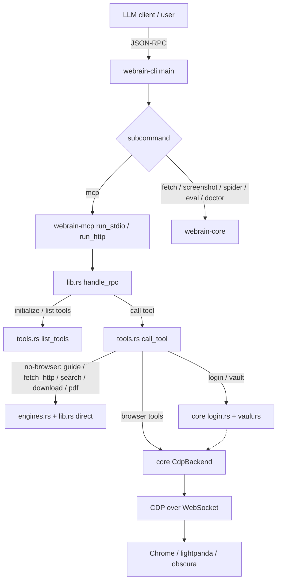

# Runtime Flow & Architecture

This page walks the whole system: how a `webrain` process starts, how an MCP
tool call travels from your LLM client to a browser, and where each piece of
runtime behavior lives. It intentionally skips user-facing feature docs (those
are in the guides and reference pages) and focuses on **how the code hangs
together**.

## Top-level shape

Three crates, one binary:



- **`webrain-cli`** — thin `match`-based subcommand entry point (no clap). Owns
  the binary and the non-MCP CLI (fetch, screenshot, spider, doctor, launch,
  login, vault, cookies, engine spawning).
- **`webrain-mcp`** — the MCP server: stdio + HTTP transports, the JSON-RPC
  dispatcher, and the 63-tool schemas + dispatch table.
- **`webrain-core`** — the runtime: CDP client, engines, install, launch,
  vault, login, vision. Both `webrain-cli` and `webrain-mcp` call into it.

## Startup & request flow

### 1. CLI entrypoint — `webrain-cli/src/main.rs`

`main()` sets up tracing (logs to **stderr** — MCP JSON must never be polluted)
then dispatches on `args[1]`:

- `webrain mcp` → `webrain_mcp::run_stdio()` (default) or
  `webrain_mcp::run_http(addr)` when `--http <port>` is passed.
- `webrain fetch <url>` / `webrain screenshot <url>` / `webrain spider <seed>`
  → attach to `CDP_URL` and drive `CdpBackend` directly.
- `webrain doctor` / `--doctor` → full install diagnosis (exits 0 healthy,
  2 broken).

### 2. MCP server — `webrain-mcp/src/lib.rs`

Two transports, one dispatcher:

- **`run_stdio()`** — reads newline-delimited JSON-RPC from stdin, one
  `CdpBackend` session at a time: `handle_rpc(msg, &mut backend)` →
  `with_token_cost(...)` → write the response line. (lib.rs:669)
- **`run_http(addr)`** — HTTP transport with a per-`Mcp-Session-Id` backend
  map: a session is minted on `initialize` and reused when the header matches.

Every message funnels into **`handle_rpc()`** (lib.rs:51-608). It routes
`initialize` / notifications / `tools/list` / `tools/call`, and intercepts a
handful of tools **before** the CDP backend is touched because they need no
browser: `webrain_guide`, `webrain_scrape` (fetch_http), `webrain_search`,
`webrain_download`, `webrain_pdf` (render / images ops). The consolidated
16-tool surface (`observe`/`interact`/`extract`/`crawl`/`session`/…) is folded
to these executors up front by `tools::map_surface()`.

### 3. Tool registration — `webrain-mcp/src/tools.rs`

- **`list_tools()`** — the **15 consolidated `webrain_*` schemas** the LLM
  sees, with canonical descriptions (63 legacy one-action names still dispatch
  via `map_surface()`; their executor arms live in `call_tool()`).
- **`call_tool()`** — the dispatch: `map_surface(name, args)` folds a
  consolidated `what`/`action`/`op`/`mode` selector into the legacy arm name,
  then `match tool_name` resolves a `BrowserBackend` (usually a `CdpBackend`)
  and invokes the core logic. Tools are grouped around
  `webrain_core::engines`, `webrain_core::backends::cdp`, `webrain_core::login`,
  and `webrain_core::vision`.
- **`store_launched()` / `close_launched()`** — the launched-browser registry,
  keyed `"service:profile"`, so `webrain_login` can re-attach to a profile.

## Tool execution pipeline

A browser tool call (e.g. `webrain_navigate`) resolves like this:

```text
tools/call webrain_navigate
  → call_tool()                  webrain-mcp/src/tools.rs
  → CdpBackend::ensure_page_attached()   (attach WS + stealth hardening)
  → BrowserBackend::navigate(url)        webrain-core/src/browser.rs (trait)
  → CdpBackend::navigate()               webrain-core/src/backends/cdp.rs
  → CDP Page.navigate over the shared WebSocket
  → PageState { title, text, elements, links, challenge }
```

Shared behavior lives in the **`BrowserBackend` trait**
(`webrain-core/src/browser.rs`) — every engine path implements the same
navigate/eval/click/screenshot/a11y surface, so tools never care which browser
is underneath. Extraction and crawling tools bypass the browser entirely:
`webrain_extract` (schema / regex / table / autoschema / bm25 modes) runs
**in-page JS, zero-LLM**, and `webrain_scrape` / `webrain_search` /
`webrain_crawl` (sitemap mode) are pure HTTP.

## Browser & engine orchestration

- **Install** (`webrain-core/src/install.rs`): `install_chrome()` fetches the
  Chrome for Testing JSON, downloads the platform zip, extracts it under
  `browsers_dir()` (the engine cache), and returns the binary path
  (install.rs:383). `install_obscura()` mirrors it for the Obscura release.
- **Launch** (`webrain-core/src/launch.rs`): spawns Chrome / lightpanda /
  obscura and waits for the CDP endpoint; the `Launched` handle is kept in the
  MCP registry.
- **Engines** (`webrain-core/src/engines.rs`): `http_fetch` (no browser),
  `SpiderEngine` (BFS/DFS/best-first + autothrottle + checkpoint/resume),
  `TileEngine` (vision tiles), extraction + BM25, and download (http + yt-dlp).

All engines speak **CDP**, so one backend drives all of them — the difference
is capability (paint engine, a11y fidelity, parallel tabs), not protocol.

## CDP backend & browser control

`CdpBackend` (`webrain-core/src/backends/cdp.rs`) owns the WebSocket to the
browser. On attach it applies **stealth hardening** (UA override,
`Emulation.setAutomationOverride`, JS patches) so it can log into real sites.
It is `Clone` sharing one WS; batch = a tokio semaphore + one tab per URL.
Sessions pool browsers per `session_id` for parallel subagent isolation.

## Login, vault & challenges

- **Vault** (`webrain-core/src/vault.rs`): credentials encrypted with
  **AES-256-GCM**; `get`/`set`/`remove` plus TOTP (`totp_code` / `totp_at`).
  Secrets are decrypted in-process and injected via CDP — never through the
  model.
- **Login** (`webrain-core/src/login.rs`): `run_login()` is shared by the CLI
  (`webrain login`) and the MCP `webrain_login` tool. It navigates, evaluates
  the login JS, then polls `has_session` / `gate_up` — TOTP auto-fill via the
  vault seed, a `waiting_for_human: true` reply on a 2FA gate, and a 15s
  timeout with a clear message (login.rs:96).
- **Challenges**: `webrain_navigate` returns a `challenge` field on every
  call. When it is non-null, only **real Chrome** can pass it — start Chrome on a
  persistent profile (`webrain launch` / `webrain_session(op=login)`, vault +
  TOTP) and re-attach via the shared CDP session.

## Operational boundaries & failure points

| Layer | Where it lives | Symptom → first check |
|---|---|---|
| MCP transport | `webrain-mcp/src/lib.rs` | `webrain doctor` shows MCP down → `webrain mcp --http 9223`; logs on stderr |
| Browser attach | `backends/cdp.rs` | dead-socket errors (`os error 10054`) → restart the browser; backend reconnects |
| Engine install | `install.rs` | *"shared library"* / spawn failure → `webrain install` or missing Linux libs |
| Stealth / challenge | `login.rs` + `launch.rs` + `backends/cdp.rs` (native) | `waiting_for_human:true` → interactive gate, human needed |
| Login / vault | `login.rs` + `vault.rs` | `no session cookie after 15s` → check creds; 0 cookies on a logged-in browser → restart killed the session |
| Extraction | `engines.rs` | 0 items → verify the page isn't a block page, re-run `webrain_extract` (mode=autoschema) |

## Relevant source files

| Concept | File |
|---|---|
| CLI entrypoint | `webrain-cli/src/main.rs` |
| MCP transports + dispatcher | `webrain-mcp/src/lib.rs` |
| Tool schemas + dispatch | `webrain-mcp/src/tools.rs` |
| Backend trait | `webrain-core/src/browser.rs` |
| CDP backend | `webrain-core/src/backends/cdp.rs` |
| Engines (fetch/spider/tile/extract/bm25/download) | `webrain-core/src/engines.rs` |
| Engine install | `webrain-core/src/install.rs` |
| Browser/engine launch | `webrain-core/src/launch.rs` |
| Login | `webrain-core/src/login.rs` |
| Credential vault + TOTP | `webrain-core/src/vault.rs` |
| Vision tiles + vector store | `webrain-core/src/vision.rs` |
| Challenge handling | `login.rs` + `launch.rs` (native) |
