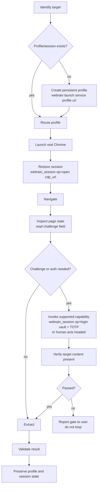

# Protected-Site Workflow

Canonical end-to-end workflow for unknown, authenticated, or protected websites.
Follow it exactly — never start statelessly.

## Steps
1. Identify the target (what, where, auth?).
2. Determine whether a profile/session already exists for the service.
3. Select a persistent profile (`webrain_session(op=profiles)` / CLI launch).
4. Launch real Chrome on that profile.
5. Restore/establish the session (`webrain_session(op=open, cdp_url=...)`).
6. Navigate.
7. Inspect page state — read `challenge`.
8. Detect challenge/auth/block state.
9. Invoke the supported internal capability (native login, vault + TOTP), or let
   the human act in the headed browser (2FA/approval).
10. Verify the target content (not a challenge/login/consent page).
11. Extract.
12. Validate the result.
13. Preserve the session/profile state when appropriate (don't discard it).

## Explicitly prohibited
- stateless first attempt → blocked → fresh browser → fresh profile
- discarding a working profile/session after a challenge
- reintroducing an external Python sidecar (challenge handling is native)
